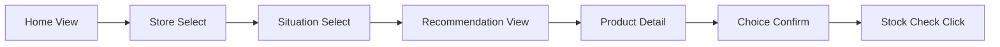

# 여행한끼

> 해외여행 중 식당 대신 마트·편의점에서 한 끼를 해결해야 할 때, **지금 내 상황에 맞는 상품을 빠르게 골라주는 서비스**


## 0. 이 문서를 읽는 개발/코딩 에이전트에게

이 저장소의 목표는 **완성도 높은 글로벌 여행 플랫폼을 한 번에 만드는 것**이 아니다.  
수업 프로젝트의 핵심은 `가설 → MVP → 사용자 행동 측정 → 학습 → 다음 가설`의 반복이다.

따라서 첫 구현은 아래 원칙을 반드시 지킨다.

1. **한국인 대학생의 일본 오사카 여행 상황**에 집중한다.
2. 지역은 **오사카 난바**로 제한한다.
3. 매장은 우선 **LIFE 난바점 1곳 + 난바 인근 Lawson 1곳**만 대상으로 한다.
4. 첫 버전의 핵심은 **매장 선택 → 상황 선택 → 추천 → 상품 상세 → `이거 살래요`** 흐름이다.
5. **실시간 재고는 구현하지 않는다.** 대신 `재고 확인` 버튼을 Fake Door로 제공해 수요를 측정한다.
6. 상품 데이터는 초기에는 정적 Seed/Mock 데이터로 구현 가능하되, **실제 재고처럼 표현하면 안 된다.**
7. Google Analytics 4(GA4)를 연결해 단순 설문보다 **클릭, 화면 도달, 전환, 결정 시간 등 실제 행동 데이터**를 수집한다.
8. 모바일 여행 상황이므로 **Mobile First**로 제작한다.
9. UI보다 실험 가능성이 우선이지만, 디자인은 여행·식품 서비스답게 시각적으로 충분히 완성도 있게 만든다.
10. GA Measurement ID가 없어도 로컬에서 앱이 정상 동작하도록 분석 코드를 안전하게 처리한다.

---

## 1. 프로젝트 개요

### 서비스명

**여행한끼**

### 슬로건

**여행지 마트에서, 오늘 뭐 먹지?**

### 서비스 한 문장

해외여행 중 식당 대신 현지 마트나 편의점에서 한 끼를 해결해야 할 때, 사용자가 방문한 **매장과 현재 식사 상황**을 기준으로 이해하기 쉬운 한국어 정보와 함께 간편식을 추천한다.

### MVP 목표

좋은 추천 알고리즘을 만드는 것이 1차 목표가 아니다.

> **상황·매장 기반 간편식 추천이 실제로 사용자의 상품 선택을 만들어내는가?**

이 질문을 실제 사용자 행동 데이터로 검증하는 것이 MVP의 목표다.

---

## 2. 타깃과 범위

### Primary Persona

**오사카를 자유여행하는 한국인 대학생**

예시 페르소나:

- 22세 대학생
- 친구와 3박 4일 오사카 자유여행
- 난바 주변 숙소 이용
- 일본어를 잘 읽지 못함
- 맛집 방문을 좋아하지만 모든 끼니를 식당에서 해결하지 않음
- 아침, 야식, 일정 사이 간단한 식사를 편의점/마트에서 해결
- 상품을 고를 때 번역 앱, 블로그, Instagram, TikTok 등을 오가는 것이 번거로움

### MVP 지역

```text
한국인 대학생 → 일본 → 오사카 → 난바 → LIFE + Lawson
```

> 위 텍스트는 범위 설명용이며 UI에 그대로 노출할 필요는 없다.


### 초기 대상 매장

- **Central Square LIFE Namba**
- **Lawson Naniwa Minatomachi 1-chome** 또는 MVP 테스트에 사용하기 좋은 난바 인근 Lawson 1개 지점

초기 매장은 설정값으로 분리해 나중에 쉽게 추가할 수 있게 한다.

---

## 3. 해결하려는 문제

여행자는 일본 마트나 편의점에서 상품을 보고 다음 과정을 반복한다.

1. 진열대에서 상품 발견
2. 일본어를 이해하지 못해 촬영/번역
3. 어떤 음식인지는 파악
4. 맛있는지, 배부른지, 지금 상황에 맞는지는 여전히 모름
5. 블로그/SNS/검색으로 추천 제품 탐색
6. 추천된 제품이 현재 매장에 있는지 다시 확인
7. 비교 후 구매

핵심 문제는 단순한 **Translation Problem**이 아니다.

> **사용자가 원하는 것은 일본어 번역이 아니라, 지금 실패하지 않을 한 끼를 빨리 고르는 것**이다.

### Problem Statement

> 오사카를 자유여행하는 한국 대학생은 식당 대신 편의점이나 마트에서 한 끼를 해결해야 할 때, 일본어와 현지 상품에 대한 경험이 부족하여 자신의 상황에 맞는 상품을 빠르게 선택하기 어렵다.


---

## 4. TO-BE 경험

여행한끼에서는 사용자의 의사결정 과정을 아래처럼 줄인다.

1. 현재 매장 선택
2. 현재 필요한 한 끼 상황 선택
3. 해당 조건에 맞는 추천 리스트 확인
4. 상품 상세에서 한국어 설명/가격대/포만감/조리 여부 확인
5. `이거 살래요` 선택
6. 이후 `재고 확인` 버튼에 대한 수요 측정


### 핵심 전환

**AS-IS**

`탐색 → 촬영 → 번역 → SNS 검색 → 비교 → 선택`

**TO-BE**

`매장 → 상황 → 추천 → 상세 → 선택`

---

## 5. 핵심 가설

### H1. Problem Hypothesis

일본 여행 경험이 있는 대학생은 편의점·마트에서 상품을 선택할 때 실제 불편함을 경험한다.

### H2. Recommendation Hypothesis

상품을 단순 번역하는 것보다 **현재 상황에 맞는 상품을 추천**하면 사용자의 상품 선택이 빨라진다.

### H3. Store Context Hypothesis

`일본 인기상품 TOP 10` 같은 일반 리스트보다 **현재 방문한 매장을 기준으로 한 추천**이 구매 의사결정에 더 도움이 된다.

### H4. Inventory Hypothesis

상품을 고른 사용자는 추천 이후 **실제로 해당 매장에서 구매 가능한지** 알고 싶어 한다.

H4는 실제 재고 API를 구현하기 전에 Fake Door로 먼저 검증한다.

---

## 6. MVP Information Architecture


권장 URL 구조는 다음과 같다.

```text
/
/situation?store={storeId}
/recommendations?store={storeId}&situation={situationId}
/product/{productId}
```

`이거 살래요`, `재고 확인`은 별도 페이지 또는 Bottom Sheet/Modal 중 사용자 흐름이 더 짧은 방식으로 구현해도 된다.

---

## 7. 핵심 사용자 플로우


필수 Happy Path:

1. Home 진입
2. 매장 선택
3. 상황 선택
4. 조건 선택(선택 사항)
5. 추천 리스트 확인
6. 상품 카드 선택
7. 상품 상세 확인
8. `이거 살래요` 클릭
9. Choice 이벤트 기록
10. `재고 확인` Fake Door 노출

---

# 8. 페이지별 상세 요구사항

## Page 1. Home / 매장 선택


### 목적

사용자가 서비스의 기능을 즉시 이해하고 현재 방문한 매장을 선택하게 한다.

### 필수 UI

- 서비스명 `여행한끼`
- 짧은 카피
  - `여행지 마트에서, 오늘 뭐 먹지?`
  - 또는 `지금 있는 매장에서 실패 없는 한 끼를 골라드려요.`
- Hero 이미지: `assets/meal.jpeg`
- 매장 카드 2개
  - LIFE Namba
  - Lawson
- 각 카드에 매장 유형 표시
  - `슈퍼마켓`
  - `편의점`
- `다음` CTA 또는 카드 클릭 즉시 이동

### 사용자 행동 이벤트

- `home_view`
- `store_select`

### 이벤트 파라미터

```ts
{
  store_id: "life_namba",
  store_type: "supermarket"
}
```

### Success Indicator

- Home 진입 사용자 대비 Store Select 비율

---

## Page 2. 상황 / 조건 선택


### 목적

음식 카테고리가 아니라 **현재 사용자의 상황**에서 추천을 시작한다.

### 상황 옵션

초기 MVP는 5~6개 이내로 제한한다.

- 간단한 아침
- 든든한 한 끼
- 가벼운 야식
- 이동하면서 먹기
- 술과 같이 먹기
- 가성비 있게 먹기

### Optional Filter

- 최대 가격
  - 500엔 이하
  - 700엔 이하
  - 1,000엔 이하
- 조리 조건
  - 조리 필요 없음
  - 전자레인지 가능
  - 뜨거운 물 가능

처음부터 필터를 너무 많이 만들지 않는다.

### 이벤트

- `situation_view`
- `situation_select`
- `filter_apply`
- `recommendation_request`

### 주요 파라미터

```ts
{
  store_id: "life_namba",
  situation_id: "late_night",
  max_price: 700,
  cooking: "none"
}
```

---

## Page 3. 추천 리스트


### 목적

사용자가 10초 안에 각 상품의 핵심 차이를 파악할 수 있어야 한다.

### 상품 카드 필수 정보

- 상품 이미지
- 한국어 상품명
- 일본어 원문 상품명(작게)
- 가격 또는 가격대
- 한 줄 맛 설명
- 포만감
- 조리 필요 여부
- 추천 이유 Tag
  - `야식 추천`
  - `바로 먹기 좋음`
  - `든든한 한 끼`
  - `가성비`

### Ranking

초기에는 Rule-Based Score로 충분하다.

카드에 추천 순위 자체를 강조할 필요는 없지만, Analytics에는 `rank`를 반드시 기록한다.

### 이벤트

- `recommendation_view`
- `recommendation_card_click`

### 파라미터

```ts
{
  store_id: "life_namba",
  situation_id: "late_night",
  product_id: "life_001",
  rank: 1
}
```

---

## Page 4. 상품 상세


### 목적

사용자가 최종 구매 결정을 할 수 있는 최소한의 정보를 제공한다.

### 필수 정보

- 상품 이미지
- 한국어 상품명
- 일본어 원문 상품명
- 간단한 음식 설명
- 맛 특징
- 예상 가격/가격대
- 포만감 1~5
- 매운맛 0~5
- 조리 필요 여부
- 전자레인지 필요 여부
- 추천 상황
- 알레르기/주의 정보가 확보된 경우 표시
- `이거 살래요` Primary CTA

### 중요

실제 가격이나 취급 여부를 검증하지 않은 Mock 상품의 경우 UI에 다음과 같이 명확히 표시한다.

> `MVP 추천 데이터이며 실제 매장 가격·취급 여부와 다를 수 있습니다.`

### 이벤트

- `product_detail_view`
- `choice_click`
- `choice_confirm`

### 파라미터

```ts
{
  store_id: "life_namba",
  situation_id: "late_night",
  product_id: "life_001",
  rank: 1,
  price: 398
}
```

---

## Page 5. 선택 완료 + 재고 Fake Door


### 목적

상품 선택이 일어난 이후, 사용자가 실제로 **재고/구매 가능 위치 정보까지 원하는지** 검증한다.

### UI

`이거 살래요` 클릭 후:

- 선택 완료 메시지
- `현재 이 매장에 재고가 있는지 확인해볼까요?`
- CTA: `재고 확인하기`

버튼 클릭 시 실제 재고 API를 호출하지 않는다.

표시 문구 예시:

> `실시간 매장 재고 확인 기능을 준비하고 있습니다.`

가능하면 짧은 추가 질문을 선택적으로 제공할 수 있다.

- 이 기능이 생기면 사용할 것 같다
- 현재 추천만으로 충분하다

단, **핵심 KPI는 설문 응답이 아니라 `재고 확인하기`를 실제 클릭한 행동**이다.

### 이벤트

- `choice_complete_view`
- `stock_check_click`
- `stock_fake_door_view`

---

# 9. 추천 로직

초기 MVP에서는 AI 추천이나 벡터 검색이 필요하지 않다.

## 기본 방식

각 상품에 Tag를 부여하고 사용자 조건과 매칭해 Score를 계산한다.

예시:

```ts
interface Product {
  id: string;
  storeId: "life_namba" | "lawson_namba";
  nameKo: string;
  nameJa: string;
  category: string;
  priceYen: number | null;
  fullness: 1 | 2 | 3 | 4 | 5;
  spicy: 0 | 1 | 2 | 3 | 4 | 5;
  cooking: "none" | "microwave" | "hot_water";
  portable: boolean;
  situations: SituationId[];
  tags: string[];
  image: string;
  descriptionKo: string;
  isMock: boolean;
}
```

### Score 예시

```ts
score = 0

if product.storeId === selectedStore: score += 10
if product.situations.includes(selectedSituation): score += 8
if product.priceYen <= maxPrice: score += 3
if selectedCooking === product.cooking: score += 3
if selectedSituation === "on_the_go" && product.portable: score += 4
```

Score 순으로 추천하되 동일 점수에서는 상품 순서를 적절히 분산한다.

---

# 10. Seed Data

첫 구현 시 **30~50개 데이터 구조를 수용**할 수 있게 설계한다.

실제 개발 착수 단계에서 상품 정보 수집이 완료되지 않았다면:

- 대표 상품 12~20개로 우선 UI/Analytics를 완성해도 됨
- 반드시 `isMock: true` 표시
- 허위로 `현재 재고 있음` 등을 표시하지 않음
- 이후 데이터 파일만 추가해 30~50개로 확대 가능하게 구성

권장 파일:

```text
src/data/stores.ts
src/data/products.ts
src/data/situations.ts
```

또는 JSON 기반으로 관리해도 된다.

---

# 11. Google Analytics 4 기반 행동 측정

이 MVP는 **설문에서 “쓸 것 같다”는 답을 받는 것보다 실제 행동을 측정하는 것**을 중요하게 본다.

GA4를 연결해 최소한 다음 데이터를 수집한다.

## 11.1 기본 측정 항목

- 접속 수 / Sessions
- 사용자 수 / Users
- 페이지/화면 도달
- 매장 선택 클릭
- 상황 선택 클릭
- 추천 리스트 도달
- 상품 카드 클릭
- 상품 상세 도달
- `이거 살래요` 클릭
- 재고 확인 클릭
- 선택까지 걸린 시간

## 11.2 이벤트 명세

| Event | 발생 시점 | 핵심 Parameters | 목적 |
|---|---|---|---|
| `home_view` | 홈 노출 | `source` | 유입 기준점 |
| `store_select` | 매장 선택 | `store_id`, `store_type` | 매장 선택률 |
| `situation_view` | 상황 화면 노출 | `store_id` | Funnel |
| `situation_select` | 상황 선택 | `store_id`, `situation_id` | 상황별 수요 |
| `filter_apply` | 조건 변경 | `max_price`, `cooking` | 필터 사용성 |
| `recommendation_view` | 추천 결과 노출 | `store_id`, `situation_id`, `result_count` | 추천 도달 |
| `recommendation_card_click` | 상품 카드 클릭 | `product_id`, `rank` | 추천 CTR |
| `product_detail_view` | 상세 노출 | `product_id`, `rank` | 상세 도달 |
| `choice_click` | `이거 살래요` 클릭 | `product_id`, `rank` | 구매 의향 |
| `choice_confirm` | 선택 완료 | `product_id`, `decision_time_ms` | North Star |
| `stock_check_click` | 재고 확인 클릭 | `product_id`, `store_id` | 재고 수요 |
| `stock_fake_door_view` | 준비중 안내 노출 | `product_id` | Fake Door 완료 |

## 11.3 Analytics Wrapper

컴포넌트마다 직접 분석 코드를 호출하지 말고 공통 함수에서 GTM `dataLayer`로 이벤트를 전달한다.

예시:

```ts
export function trackEvent(
  eventName: string,
  params: Record<string, string | number | boolean | undefined> = {}
) {
  if (typeof window === "undefined") return;

  window.dataLayer = window.dataLayer || [];
  window.dataLayer.push({ event: eventName, ...params });

  if (process.env.NODE_ENV === "development") {
    console.info("[analytics]", eventName, params);
  }
}
```

GTM 컨테이너 `GTM-MF3GJX4J`는 루트 레이아웃에서 로드한다. GTM이 차단되거나 로드되지 않아도 앱은 정상 동작해야 한다.

## 11.4 KPI 정의

### North Star KPI — Recommendation-to-Choice Rate

```text
choice_confirm을 1회 이상 발생시킨 사용자 수
──────────────────────────────────────────── × 100
recommendation_view를 경험한 사용자 수
```

**초기 목표: 50% 이상**  
목표치는 가설 검증을 위한 초기 기준이며 첫 테스트 데이터에 따라 조정한다.

### KPI 2 — Time to First Choice

사용자의 최초 `home_view`부터 최초 `choice_confirm`까지의 시간.

```text
choice_confirm_timestamp - first_home_view_timestamp
```

**초기 목표: 3분 이내**

`decision_time_ms`를 별도로 이벤트 파라미터로 기록할 수 있다.

### KPI 3 — Recommendation Detail CTR

```text
상품 상세를 1개 이상 본 사용자
─────────────────────────── × 100
추천 리스트를 본 사용자
```

### KPI 4 — Store Selection Rate

```text
store_select 사용자
────────────────── × 100
home_view 사용자
```

### KPI 5 — Stock Check Intent Rate

```text
stock_check_click 사용자
──────────────────────── × 100
choice_confirm 사용자
```

이 KPI가 높을 경우에만 실제 재고/API 개발 우선순위를 높인다.

## 11.5 GA 대시보드에서 보고 싶은 Breakdown

- 매장별 Choice Rate
- 상황별 Choice Rate
- 상황별 평균 선택 시간
- 추천 Rank별 카드 클릭률
- 상품별 Choice 수
- LIFE vs Lawson 행동 차이
- Stock Check 클릭률
- 모바일 기기 기준 이탈 페이지

## 11.6 개인정보 원칙

GA 이벤트에는 이름, 전화번호, 이메일 등 개인 식별 정보를 전송하지 않는다.

---

# 12. Funnel

분석 시 아래 Funnel을 핵심으로 본다.



각 단계의 사용자 수와 전환율을 GA4 Exploration 또는 별도 분석 도구에서 확인할 수 있게 이벤트를 구현한다.

---

# 13. Build–Measure–Learn


### Iteration 1

**Hypothesis**  
대학생은 일본 마트·편의점에서 상품 선택에 어려움을 겪는다.

**Measure**  
5~10명의 과거 일본 여행 경험 인터뷰

### Iteration 2

**Hypothesis**  
상황 기반 추천이 상품 선택을 만든다.

**Build**  
현재 MVP

**Measure**

- Recommendation-to-Choice Rate
- Time to First Choice
- Detail CTR

### Iteration 3

**Hypothesis**  
사용자는 매장별 추천을 선호한다.

**Measure**

- LIFE / Lawson 선택 및 전환 차이
- 매장 기반 추천 인터랙션

### Iteration 4

**Hypothesis**  
추천을 받은 사용자는 실제 재고까지 확인하고 싶어 한다.

**Build**  
Stock Check Fake Door

**Measure**  
Stock Check Intent Rate

### Iteration 5

재고 수요가 충분히 검증된 경우에만 실제 API/POS/크라우드소싱 방식 검토.

---

# 14. 재고 기능 Roadmap


재고는 다음 순서로 접근한다.

1. **상품 추천 데이터**
2. **체인/매장별 취급 정보**
3. **최근 사용자 발견 정보** — `여기 있었어요`
4. **외부 API가 있다면 매장 재고 연동**
5. **장기적으로 Retail/POS Partner 연동**

MVP에서 중요한 원칙:

> API가 없다는 이유로 재고 기능을 억지로 만들지 말고, 먼저 사용자가 재고 기능을 실제로 클릭하는지 검증한다.

---

# 15. 디자인 방향

## 핵심 키워드

- 여행
- 한 끼
- 발견
- 편리함
- 가벼움
- 친근함
- 일본 식품 패키지의 활기

## Visual Direction

- **Mobile First**
- 지나치게 관광앱처럼 만들지 않는다.
- 음식 사진이 가장 먼저 눈에 들어오게 한다.
- 흰색/오프화이트 기반의 여백이 많은 UI
- 상품 패키지의 색이 충분히 돋보이도록 UI 자체의 색은 절제
- 카드 UI는 정보가 빠르게 스캔되도록 구성
- 한 화면에서 너무 많은 정보를 노출하지 않는다.
- CTA는 `다음`, `추천 보기`, `이거 살래요`, `재고 확인하기` 등 행동 중심 한국어 문구 사용
- 영어 중심 브랜딩은 피한다.

## Hero Image

`assets/meal.jpeg`를 메인 비주얼 또는 디자인 무드 참고 이미지로 활용한다.

> 실제 서비스 공개 단계에서는 이미지 및 상품 패키지의 사용 권한을 별도로 확인한다.

## 디자인 참고

- https://github.com/voltagent/awesome-design-md
- https://getdesign.md/

에이전트는 가능하면 위 자료의 방식을 참고해 프로젝트 루트에 `DESIGN.md`를 별도로 생성하고, 이 프로젝트에 맞는 Typography / Spacing / Card / Button / Color / Image Treatment 규칙을 명시한다.

중요: 특정 브랜드 디자인을 그대로 복제하기보다 **여행한끼의 목적에 맞게 재구성**한다.

---

# 16. 권장 기술 스택

기존 프로젝트에 기술 스택이 이미 있다면 기존 스택을 우선한다.

신규 프로젝트라면 다음 구성을 기본값으로 권장한다.

- Next.js
- TypeScript
- Tailwind CSS
- 필요 시 shadcn/ui 또는 가벼운 자체 컴포넌트
- GA4 / Google Tag
- Static Seed Data
- Vercel 배포

### 첫 MVP에서는 불필요한 것

- 회원가입
- DB 서버
- 결제
- 복잡한 인증
- Vector DB
- LLM API
- 실시간 WebSocket
- 자체 추천 ML 모델

사용자 행동 분석이 필요하면 익명 Session ID 정도만 로컬에서 생성해 사용할 수 있다.

---

# 17. 권장 프로젝트 구조

```text
.
├── README.md
├── DESIGN.md
├── public/
│   └── images/
├── src/
│   ├── app/
│   │   ├── page.tsx
│   │   ├── situation/
│   │   ├── recommendations/
│   │   └── product/[id]/
│   ├── components/
│   │   ├── StoreCard.tsx
│   │   ├── SituationChip.tsx
│   │   ├── ProductCard.tsx
│   │   ├── ProductDetail.tsx
│   │   └── StockFakeDoor.tsx
│   ├── data/
│   │   ├── stores.ts
│   │   ├── situations.ts
│   │   └── products.ts
│   ├── lib/
│   │   ├── analytics.ts
│   │   └── recommendation.ts
│   └── types/
│       └── index.ts
└── .env.example
```

폴더 구조는 사용 중인 프레임워크에 따라 변경 가능하다.

---

# 18. 반응형/접근성 요구사항

- 360px 모바일 너비부터 정상 작동
- 390px~430px 스마트폰을 우선 검증
- Desktop에서도 깨지지 않지만 모바일 UX가 우선
- 주요 CTA 최소 터치 영역 확보
- 상품 이미지에 `alt` 제공
- 텍스트 대비 확보
- 버튼은 단순 `div onClick` 대신 semantic button 사용
- Keyboard focus 지원
- Loading / Empty / Error 상태 구현

---

# 19. Empty / Error States

### 추천 결과 없음

> `조건에 딱 맞는 상품을 찾지 못했어요.`  
> `가격 또는 조리 조건을 조금 넓혀보세요.`

CTA: `조건 다시 선택하기`

### 이미지 없음

기본 음식 Placeholder를 사용한다.

### Analytics 연결 안 됨

사용자에게 에러를 노출하지 않고 앱은 정상 동작한다.

---

# 20. MVP에서 제외할 것

다음 항목은 첫 구현에 포함하지 않는다.

- 일본 전 지역
- 모든 편의점/마트
- 실시간 재고 조회
- 로그인/회원가입
- 결제
- 배송
- 사용자 리뷰 커뮤니티
- 음식점 추천
- AI 챗봇
- OCR 기반 실시간 제품 인식
- 카메라 번역
- 복잡한 개인화 추천
- 푸시 알림

Scope Creep이 발생하면 항상 **사용자 행동 데이터 검증에 필요한 기능인지**를 먼저 판단한다.

---

# 21. Definition of Done

에이전트는 다음 항목을 모두 만족하면 1차 MVP를 완료한 것으로 본다.

- [ ] 한국어 서비스명 `여행한끼` 사용
- [ ] Mobile First Home 구현
- [ ] Hero 이미지 적용
- [ ] LIFE / Lawson 매장 선택 가능
- [ ] 상황 선택 가능
- [ ] 선택 조건 기반 추천 결과 표시
- [ ] 추천 상품 상세 화면 구현
- [ ] `이거 살래요` 행동 구현
- [ ] 재고 확인 Fake Door 구현
- [ ] 실제 재고인 것처럼 오해시키는 표현 없음
- [ ] Mock 데이터 표시 정책 반영
- [ ] GA4 연결 구조 구현
- [ ] 위 Analytics Event 전부 추적 가능
- [ ] GA ID가 없는 로컬 환경에서도 오류 없음
- [ ] `decision_time_ms` 계산 가능
- [ ] 360px 모바일에서 UI 정상
- [ ] Empty/Error State 구현
- [ ] `DESIGN.md` 작성
- [ ] `.env.example` 작성
- [ ] 프로젝트 실행 방법 README 또는 별도 문서에 추가

---

# 22. Agent 작업 우선순위

## P0 — 반드시 구현

1. 프로젝트 Scaffold
2. Design System / `DESIGN.md`
3. Seed Data / Types
4. Home / Store Selection
5. Situation Selection
6. Recommendation Logic
7. Recommendation List
8. Product Detail
9. `이거 살래요`
10. Stock Fake Door
11. Analytics Wrapper
12. GA Events
13. Responsive QA

## P1 — 시간 여유 시

- 저장 기능
- 공유 기능
- 최근 선택 상품
- 추천 조건 수정 UX
- 간단한 Funnel Debug Panel(dev only)

## P2 — MVP 이후

- 실제 상품 데이터 확장
- Crowdsourced `여기 있었어요`
- 매장 API 조사
- 실제 재고 연동
- 다른 일본 도시 확장
- 다국어 지원

---

# 23. 참고 링크

## 디자인

- Awesome Design MD  
  https://github.com/voltagent/awesome-design-md
- Get Design  
  https://getdesign.md/

## Google Analytics

- Google Analytics 등록  
  https://analytics.google.com/analytics/web/#/provision

---

# 24. 상세 기획 문서

이 README와 함께 다음 자료를 참고한다.

- `docs/여행한끼_MVP_서비스_기획안.docx`
- `docs/여행한끼_MVP_서비스_기획안_슬라이드.pptx`
- `assets/diagrams/` 내부의 사용자 흐름, 와이어프레임, Build–Measure–Learn, Roadmap 이미지

README와 상세 문서가 충돌하는 경우 **MVP Scope 및 Analytics 구현에서는 README의 최신 요구사항을 우선**한다.

---

# 25. 에이전트에게 전달할 최종 구현 요청

> 이 README를 프로젝트의 Product Requirement 문서로 간주하고 `여행한끼` MVP를 구현한다. 먼저 현재 저장소 구조를 파악한 후, 기존 스택이 있다면 최대한 유지한다. 신규 프로젝트라면 Next.js + TypeScript 기반의 Mobile First 웹앱을 우선 고려한다. `assets/meal.jpeg`와 제공된 기획 다이어그램을 참고하되, 모든 핵심 요구사항은 텍스트 명세를 기준으로 구현한다. 실시간 재고는 만들지 않고 Fake Door로 검증한다. Google Analytics 4 이벤트를 구현해 Home → Store → Situation → Recommendation → Product → Choice → Stock Check Funnel이 실제 행동 데이터로 측정되도록 한다. UI는 한국인 대학생 여행자를 대상으로 친근하고 현대적인 식품/여행 경험으로 제작하며, 구현 전에 `DESIGN.md`를 작성하고 그 규칙을 일관되게 적용한다. 기능 구현 후 모바일 반응형, 이벤트 로깅, Empty/Error State를 검증하고 실행 방법과 환경변수 설정을 문서화한다.

---

## 핵심 문장

> **여행한끼의 첫 MVP는 “좋은 앱을 완성하는 것”보다 “사용자가 실제로 추천을 보고 한 끼를 선택하는지 측정하는 것”을 우선한다.**


---

# 26. 개발 환경 설정 및 실행 방법

## 요구 사항

- Node.js 18+ (권장: 20+)
- npm 9+

## 설치

```bash
# 의존성 설치
npm install
```

## 환경 변수

```bash
# .env.example을 복사하여 .env.local 생성
cp .env.example .env.local
```

GTM 컨테이너는 앱에 직접 설정되어 있으므로 별도의 GA4 Measurement ID 환경 변수는 필요하지 않습니다. Google Maps를 사용하려면 `.env.local`에 다음 값을 설정하세요.

```env
NEXT_PUBLIC_GOOGLE_MAPS_API_KEY=your_google_maps_api_key_here
```

## 개발 서버 실행

```bash
npm run dev
```

브라우저에서 http://localhost:3000 접속.

개발 환경에서는 GA 이벤트가 콘솔에 `[analytics]` 프리픽스로 출력됩니다.

## 빌드 및 프로덕션 실행

```bash
npm run build
npm start
```

## Vercel 배포

```bash
# Vercel CLI 사용 시
npx vercel
```

또는 GitHub 연동 후 Vercel 대시보드에서 Import 하면 자동 배포됩니다.

## 프로젝트 구조

```
src/
├── app/                    # Next.js App Router 페이지
│   ├── page.tsx           # Home / 매장 선택
│   ├── situation/         # 상황 선택
│   ├── recommendations/   # 추천 리스트
│   └── product/[id]/      # 상품 상세 + 선택 완료
├── components/            # 공통 컴포넌트
├── data/                  # Seed 데이터 (stores, products, situations)
├── lib/                   # 유틸리티 (analytics, recommendation)
└── types/                 # TypeScript 타입 정의
```

## 모바일 테스트

Chrome DevTools → Toggle Device Toolbar (Ctrl+Shift+M)에서 iPhone 14 Pro (390×844) 또는 Galaxy S21 (360×800)으로 확인하세요.
